# 🌟 Fashion Studio ETL Pipeline

<div align="center">


[](https://opensource.org/licenses/MIT)
[](https://github.com/notsuperganang)

**High-performance ETL pipeline for fashion product data extraction, transformation, and loading**

[🚀 Getting Started](#getting-started) •
[📖 Documentation](#documentation) •
[🧪 Testing](#testing) •
[🤝 Contributing](#contributing) •
[📄 License](#license)

</div>

---

## 📋 Table of Contents

- [✨ Features](#-features)
- [🏗️ Architecture](#️-architecture)
- [🚀 Getting Started](#-getting-started)
  - [Prerequisites](#prerequisites)
  - [Installation](#installation)
  - [Configuration](#configuration)
- [💻 Usage](#-usage)
  - [Basic Usage](#basic-usage)
  - [Advanced Examples](#advanced-examples)
  - [Command Line Options](#command-line-options)
- [🔄 Pipeline Stages](#-pipeline-stages)
- [📊 Data Repositories](#-data-repositories)
- [🧪 Testing](#-testing)
- [📁 Project Structure](#-project-structure)
- [🎯 Performance](#-performance)
- [🐛 Troubleshooting](#-troubleshooting)
- [🤝 Contributing](#-contributing)
- [📄 License](#-license)
- [👨‍💻 Author](#-author)

## ✨ Features

🔥 **Core Capabilities**
- **Web Scraping**: Intelligent extraction from Fashion Studio website with rate limiting
- **Data Transformation**: Automated cleaning and currency conversion (USD → IDR)
- **Multi-Repository Support**: CSV, Google Sheets, and PostgreSQL output
- **Modular Design**: Separate extract, transform, and load modules
- **Error Handling**: Comprehensive error management and retry mechanisms
- **Progress Tracking**: Real-time progress bars and colored logging
- **Unit Testing**: 90%+ test coverage with pytest

🚀 **Advanced Features**
- **Configurable Exchange Rates**: Dynamic USD to IDR conversion
- **Batch Processing**: Efficient handling of large datasets
- **Timestamp Tracking**: Data lineage with extraction timestamps
- **Dry Run Mode**: Validate transformations without saving
- **Flexible Execution**: Run individual stages or complete pipeline

## 🏗️ Architecture

```mermaid
graph LR
    A[🌐 Fashion Studio Website] --> B[📥 Extract]
    B --> C[🔄 Transform]
    C --> D[📤 Load]
    D --> E[📊 CSV]
    D --> F[📊 Google Sheets]
    D --> G[📊 PostgreSQL]
    
    H[⚙️ Configuration] --> B
    H --> C
    H --> D
    
    I[🧪 Unit Tests] --> B
    I --> C
    I --> D
```



## 🚀 Getting Started

### Prerequisites

- **Python 3.9+** 
- **pip** package manager
- **Internet connection** for web scraping
- **PostgreSQL** (optional, for database output)
- **Google Cloud Console** account (for Google Sheets integration)

### Installation

1. **Clone the repository**
   ```bash
   git clone https://github.com/notsuperganang/etl-pipeline.git
   cd etl-pipeline
   ```

2. **Install dependencies**
   ```bash
   pip install -r requirements.txt
   ```

3. **Verify installation**
   ```bash
   python main.py --help
   ```

### Configuration

1. **Google Sheets API Setup**
   - Place your `google-sheets-api.json` credentials file in the project root
   - Ensure the service account has edit permissions for your target sheet

2. **PostgreSQL Setup** (Optional)
   ```bash
   # Install PostgreSQL
   sudo apt-get install postgresql postgresql-contrib

   # Create database
   createdb fashion_data
   ```

## 💻 Usage

### Basic Usage

Run the complete ETL pipeline:

```bash
python main.py
```

### Advanced Examples

**Extract only with custom page limit:**
```bash
python main.py --stages extract --max-pages 25 --save-raw
```

**Transform with custom exchange rate:**
```bash
python main.py --stages transform --exchange-rate 15500.0 --input-file raw_products.csv
```

**Load to all repositories:**
```bash
python main.py --repositories all \
               --db-user YOUR_USERNAME \
               --db-pass YOUR_PASSWORD \
               --google-sheet-id "1pAIzUF4hIjiUl0oq8r5fB6aYCi_MQBI_l3Nfm9_1ois"
```

**Dry run for validation:**
```bash
python main.py --dry-run --verbose
```

### Command Line Options

| Option | Description | Default |
|--------|-------------|---------|
| `--stages` | Pipeline stages to run (`extract`, `transform`, `load`, `all`) | `all` |
| `--max-pages` | Maximum pages to scrape | `50` |
| `--exchange-rate` | USD to IDR exchange rate | `16000.0` |
| `--repositories` | Target repositories (`csv`, `sheets`, `postgres`, `all`) | `csv` |
| `--dry-run` | Validate without saving | `False` |
| `--verbose` | Detailed error messages | `False` |

<details>
<summary>📋 View all options</summary>

```bash
python main.py --help
```
</details>

## 🔄 Pipeline Stages

### 1. 📥 Extract (`extract.py`)
- Scrapes product data from Fashion Studio website
- Handles pagination and rate limiting
- Extracts: Title, Price, Rating, Colors, Size, Gender
- Adds extraction timestamp for data lineage

### 2. 🔄 Transform (`transform.py`)
- Converts USD prices to IDR using configurable exchange rate
- Cleans and validates data (removes duplicates, invalid entries)
- Standardizes data formats and types
- Handles missing values appropriately

### 3. 📤 Load (`load.py`)
- Supports multiple output formats:
  - **CSV**: Local file storage
  - **Google Sheets**: Cloud-based collaboration
  - **PostgreSQL**: Relational database storage
- Batch processing for large datasets
- Automatic schema creation and data validation

## 📊 Data Repositories

### CSV Output
```
products.csv
├── Title (string)
├── Price (float, IDR)
├── Rating (float)
├── Colors (integer)
├── Size (string)
├── Gender (string)
└── timestamp (datetime)
```

### Google Sheets
- **Sheet**: [Fashion Products Data](https://docs.google.com/spreadsheets/d/1pAIzUF4hIjiUl0oq8r5fB6aYCi_MQBI_l3Nfm9_1ois)
- Automatic formatting and header styling
- Real-time collaboration support

### PostgreSQL Schema
```sql
CREATE TABLE fashion_products (
    id SERIAL PRIMARY KEY,
    title VARCHAR(255),
    price DECIMAL(10,2),
    rating DECIMAL(3,2),
    colors INTEGER,
    size VARCHAR(50),
    gender VARCHAR(20),
    timestamp TIMESTAMP
);
```

## 🧪 Testing

Run the complete test suite:

```bash
# Run all tests with coverage
./run_all_tests.sh

# Run specific test modules
pytest tests/test_extract.py -v
pytest tests/test_transform.py -v
pytest tests/test_load.py -v

# Generate coverage report
pytest tests/ --cov=utils --cov=main --cov-report=html
```

**Test Coverage: 90%+**
- Comprehensive unit tests for all modules
- Mock objects for external dependencies
- Edge case and error handling coverage

## 📁 Project Structure

```
etl-pipeline/
├── 📄 main.py              # Main ETL pipeline orchestrator
├── 📄 requirements.txt     # Python dependencies
├── 📄 submission.txt       # Project documentation
├── 📁 utils/               # Core ETL modules
│   ├── 📄 extract.py       # Web scraping module
│   ├── 📄 transform.py     # Data transformation
│   └── 📄 load.py          # Multi-repository loader
├── 📁 tests/               # Unit tests
│   ├── 📄 test_extract.py
│   ├── 📄 test_transform.py
│   └── 📄 test_load.py
├── 📄 setup.cfg            # Test configuration
├── 📄 run_all_tests.sh     # Test runner script
├── 📄 google-sheets-api.json # Google API credentials
└── 📄 products.csv         # Output data file
```

## 🎯 Performance

- **Scraping Speed**: ~2-3 pages per second with rate limiting
- **Memory Efficient**: Processes data in configurable chunks
- **Concurrent Processing**: Optimized for I/O operations
- **Error Recovery**: Automatic retry mechanisms for network failures

## 🐛 Troubleshooting

<details>
<summary>Common Issues and Solutions</summary>

**Google Sheets Access Denied**
```bash
# Ensure your service account has edit permissions
# Check the google-sheets-api.json file is valid
```

**PostgreSQL Connection Failed**
```bash
# Verify PostgreSQL is running
sudo systemctl status postgresql

# Check connection parameters
python main.py --db-host localhost --db-user postgres
```

**Memory Issues with Large Datasets**
```bash
# Reduce the number of pages
python main.py --max-pages 10
```

**Rate Limiting**
```bash
# The pipeline includes automatic delays
# Use --verbose to monitor request patterns
python main.py --verbose
```
</details>

## 🤝 Contributing

Contributions are welcome! Please read our [Contributing Guidelines](CONTRIBUTING.md) first.

### Development Setup

1. Fork the repository
2. Create a feature branch: `git checkout -b feature/amazing-feature`
3. Make your changes and add tests
4. Ensure tests pass: `./run_all_tests.sh`
5. Commit your changes: `git commit -m 'Add amazing feature'`
6. Push to the branch: `git push origin feature/amazing-feature`
7. Open a Pull Request

### Code Standards

- Follow PEP 8 style guidelines
- Add unit tests for new features
- Maintain test coverage above 80%
- Document new functions and classes

## 📄 License

This project is licensed under the MIT License - see the [LICENSE](LICENSE) file for details.

## 👨‍💻 Author

**notsuperganang**
- GitHub: [@notsuperganang](https://github.com/notsuperganang)
- Project: [ETL Pipeline](https://github.com/notsuperganang/etl-pipeline)

---

<div align="center">

**⭐ Star this repository if you found it helpful! ⭐**

[Report Bug](https://github.com/notsuperganang/etl-pipeline/issues) •
[Request Feature](https://github.com/notsuperganang/etl-pipeline/issues) •
[Follow Updates](https://github.com/notsuperganang/etl-pipeline/watchers)

</div>